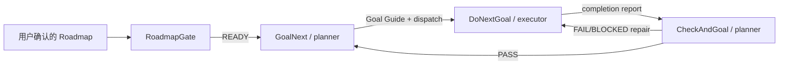

# GoalNext Skill Workflows

GoalNext 是一套面向 Codex 可见会话的工作流 Skill。它把规划、执行、验收和跨会话交接写进项目文档与 Git，使每个会话职责更窄、上下游更清楚，也让用户随时可以检查和干预。

它不依赖隐式 subagent。规划者、执行者和其他专业角色都是你在 Codex 中看得见的会话。

<!-- roadmap-policy: user-owned; ai-assist: grill-me; bundled: fallback -->

## 先准备 Roadmap：你负责设计，我们只提供兜底

Roadmap 决定项目方向、阶段顺序和退出条件，因此它的设计与确认权属于你，而不是某个 Skill。

推荐顺序是：

1. **首选：自己完成 Roadmap 设计。** 使用产品目标、设计文档、技术约束和已有项目事实，直接维护项目根目录的 `ROADMAP.md`。
2. **需要 AI 辅助时：使用 `$grill-me`。** 让它质询目标、范围、依赖和风险；你审阅结果并亲自形成最终 Roadmap。`grill-me` 是外部可选 Skill，不随本项目打包。
3. **最后兜底：使用 `$createroadmap`。** 它可以从文档或自由描述生成 proposed 草案，但不是本项目推荐的默认入口，并且仍然必须由你明确确认。

一份可供工作流使用的 Roadmap 至少应包含：

- 项目目标与非范围；
- 可验证的阶段成果；
- 阶段依赖与退出条件；
- 下一项 ready phase；
- 你确认后添加的一次性独立标记：

```html
<!-- codex-roadmap: confirmed -->
```

除 CreateRoadmap 和内部 RoadmapGate 外，其他 Skill 都会先检查这份证据。若 Roadmap 不存在或未确认，正常反应是停止原任务，建议你自行设计或使用 `$grill-me`，随后才询问是否调用 `$createroadmap` 兜底。拒绝兜底会返回 `ROADMAP_REQUIRED`，不会静默创建或确认路线。

## 三种使用方式

| 方式 | 适合谁 | 需要掌握的主要 Skill | 后续自动化 |
| --- | --- | --- | --- |
| A. 官方推荐 | 新项目，或愿意建立清晰 planner/executor 分工 | `NameYou`、`GoalNext` | 最高 |
| B. 改造现有会话 | 已经有若干工作会话，希望接入自动闭环 | `NameYou`、`ListToDecide`、`GoalNext`；按需了解 `ChooseModel`、`DoNextGoal` | 初始化后较高 |
| C. 全手动控制 | 调试、恢复、特殊拓扑，或希望逐步批准每次转移 | `ChooseModel`、`NameYou`、`ListToDecide`、`GoalNext`、`DoNextGoal`、`CheckAndGoal` | 最低 |

<!-- usage-mode: recommended -->

### A. 官方推荐：双会话自动闭环

<!-- recommended-skills: nameyou,goalnext -->

这是当前最推荐、也最容易长期维护的方式。只需要掌握 `NameYou` 和 `GoalNext`。

开始时：

1. 自己设计并确认根目录 `ROADMAP.md`。
2. 在 Codex 中手动创建两个可见会话：
   - `planner`：负责规划，也承担 checker；
   - `executor`：负责实现、验证、提交和推送。
3. 在两个会话中分别调用一次 NameYou：

```text
$nameyou 将当前会话登记为 planner，标题为“中央规划与验收”。
```

```text
$nameyou 将当前会话登记为 executor，标题为“主线执行者”。
```

4. 回到 planner 会话，启动第一阶段：

```text
$goalnext 根据已确认 Roadmap，为下一个 ready phase 创建 Goal Guide 并派发给 executor。
```

之后的预期闭环是：

1. GoalNext 写入 Goal Guide，并向 executor 发送一条带 `$donextgoal` 的路由消息。
2. executor 自动进入 DoNextGoal，按指南实施、验证、提交、推送并回报 planner。
3. planner 收到回报后自动进入 CheckAndGoal。
4. `PASS` 时 CheckAndGoal 在 planner 内进入下一次 GoalNext。
5. `FAIL/BLOCKED` 时 CheckAndGoal 将最小修复要求发回 executor。

正常情况下，你不需要手动调用 DoNextGoal、CheckAndGoal、RoadmapGate 或 AskMe。你主要负责 Roadmap、关键决策，以及在必要时干预路由。

当前尚未实现 CreateRole，因此最初两个会话仍需手动创建。未来 CreateRole 只会减少这一步操作，不会改成不可见的 subagent。

<!-- usage-mode: retrofit -->

### B. 改造现有会话：手动初始化，随后自动运行

适合已经在同一项目中拥有中央会话、编码会话或专业会话的团队。目标是保留这些会话，只补齐 Roadmap、角色和路由。

初始化步骤：

1. 自己完成并确认 `ROADMAP.md`；需要 AI 质询时先用 `$grill-me`。
2. 从现有会话中选出一个 planner/checker 和至少一个 executor。
3. 在每个选定会话中调用 `$nameyou`，把真实 thread id 和职责登记进根目录 `Role.md`。
4. 如果哪些事项需要用户拍板、哪些角色应该承担工作仍不清楚，在中央会话调用：

```text
$listtodecide 列出完成工作流初始化前需要我决定的事项，并给出推荐。
```

5. 如果需要新增会话，可先用 `$choosemodel` 获取 Thread Profile；默认配置足够时它会建议省略 model/effort，只有显式覆盖才要求你确认。
6. 在 planner 中调用 `$goalnext`，把下一阶段整理为正式 Goal Guide 并派发。
7. 如果 executor 正在执行一个旧任务、尚未收到标准路由消息，可以在该 executor 中手动调用一次 `$donextgoal` 并提供当前 Goal Guide。完成回报进入 planner 后，后续恢复为自动闭环。

预期反应：NameYou 只最小修改 `Role.md`；路由冲突或候选会话不唯一时会停下来让你选择；GoalNext 成功后应明确报告 `dispatch result: SENT`。如果是 `BLOCKED`，指南可能已经生成，但不能假装 executor 已收到任务。

<!-- usage-mode: manual -->

### C. 全手动控制：逐步调用全部工作流

这种方式适合调试 Skill、修复损坏路由、演练特殊多角色拓扑，或者你明确希望审查每次阶段转移。它不是日常推荐路径。

一次完整手动循环是：

1. 新建会话前调用 `$choosemodel`，审阅并确认模型/推理强度覆盖。
2. 手动创建会话，然后调用 `$nameyou` 登记角色。
3. 用 `$listtodecide` 解决范围、架构、预算或路由决策。
4. 在 planner 中调用 `$goalnext` 生成并检查 Goal Guide。
5. 手动确认或转发派发消息，在 executor 中调用 `$donextgoal`。
6. executor 完成后，回到 planner 手动调用 `$checkandgoal`。
7. PASS 后再次手动调用 `$goalnext`；FAIL 时检查修复消息，再在 executor 中调用 `$donextgoal`。

即使选择全手动，也通常不需要直接调用 RoadmapGate 或 AskMe。它们是内部契约；CreateRoadmap 只在你没有可用 Roadmap 且明确选择兜底时使用。

## 自动闭环如何衔接



这个循环依赖三类持久状态：

- `ROADMAP.md`：长期阶段方向，由用户设计和确认；
- `Role.md`：会话角色、路由和防重复派发字段；
- Goal Guide 与验证报告：单个阶段的范围、轮次、PASS 标准和完成证据。

## Skill 速查

| Skill | 正常调用者 | 典型反应 |
| --- | --- | --- |
| `NameYou` | 用户，高频但通常每个会话只调用一次 | 创建或最小更新 `Role.md`；绝不编造 thread id。 |
| `GoalNext` | planner；官方推荐的主要手动入口 | 创建 Goal Guide；派发结果为 `SENT / DUPLICATE / BLOCKED`。 |
| `ListToDecide` | 用户或 planner，按需 | 区分必须拍板与 Agent 可自行处理事项，然后等待选择。 |
| `ChooseModel` | 用户或未来 CreateRole，按需 | 返回 `DEFAULT_READY / OVERRIDE_PROPOSED / CONFIRMED_PROFILE / BLOCKED`；不创建会话。 |
| `DoNextGoal` | executor 收到派发后自动进入 | 执行 Goal Guide 并回报；planner notification 为 `SENT / DUPLICATE / BLOCKED`。 |
| `CheckAndGoal` | planner 收到完成回报后自动进入 | 返回 `PASS / FAIL / BLOCKED`；通过则规划下一阶段，失败则路由修复。 |
| `RoadmapGate` | 其他 Skill 显式调用的内部依赖 | 返回 `READY / ROADMAP_REQUIRED / BLOCKED`。 |
| `AskMe` | CreateRoadmap 等调用方的内部兜底 | 一次问一个高影响问题，默认五问，返回 `RESOLVED / NEEDS_MORE / BLOCKED / CANCELLED`。 |
| `CreateRoadmap` | 用户明确选择的兜底 | 生成 proposed 草案；只有用户明确确认后才写入 confirmed 标记。 |

Role 不匹配时，Skill 应停止而不是跨职责工作：GoalNext 只属于 planner，DoNextGoal 只属于 executor，CheckAndGoal 只属于 planner/checker。

## 安装

安装到默认 Codex Skills 目录：

```powershell
powershell -ExecutionPolicy Bypass -File scripts/Install-Skills.ps1
```

指定目录：

```powershell
powershell -ExecutionPolicy Bypass -File scripts/Install-Skills.ps1 -DestinationRoot C:\path\to\codex\skills
```

目标目录存在同名 Skill 时，安装默认停止。确认需要更新后显式添加 `-Force`。

安装或更新后重启 Codex，并验证：

- 显式调用：`$nameyou`、`$goalnext`；
- UI 自动补全：`@NameYou`、`@GoalNext`；
- 按需入口：`@ListToDecide`、`@ChooseModel`；
- 仅为恢复或兜底测试：`$createroadmap`、`$askme`。

## 验证

```powershell
powershell -ExecutionPolicy Bypass -File scripts/Validate-Skills.ps1
powershell -ExecutionPolicy Bypass -File scripts/Test-WorkflowContracts.ps1
git diff --check
```

验证覆盖技能闭包、调用分类、Roadmap 门禁关系、README 首次使用路径、ChooseModel 确认契约、跨 Skill 引用、UI 元数据、UTF-8 无 BOM 和常见敏感信息泄漏。

完整技能清单与关系边见 [`skill-set.json`](./skill-set.json)，项目术语见 [`CONTEXT.md`](./CONTEXT.md)，后续 CreateRole 设计见 [`ROADMAP.md`](./ROADMAP.md)。

## 分发约束

- 示例只能使用占位符，不提交真实 workspace 路径、thread id、邮箱、凭据或账号状态。
- `SKILL.md` 与 `agents/openai.yaml` 必须是 UTF-8 无 BOM。
- `Role.md` 只保存跨会话路由需要的最小字段，不保存对话或项目档案。
- 内部 Skill 必须关闭隐式调用，并由调用方显式、可见地进入。
- 模型/强度覆盖必须由用户明确批准；ChooseModel 不推测套餐或额度。
