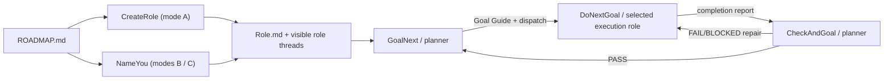

English | [简体中文](./README.zh-CN.md)

# GoalNext Skill Workflows

GoalNext is a workflow Skill bundle for visible Codex threads.

Put simply, it gives each project thread a specific responsibility and connects those threads through automated handoffs.

It records planning, execution, review, and cross-thread handoffs in project documents and Git. Each thread stays narrower, upstream and downstream relationships stay clearer, and you can inspect or intervene at any time.

It does not rely on implicit subagents. Planners, executors, and specialist roles are all visible Codex threads.

You may want it if you find Codex's built-in subagents hard to trace, hard to interrupt, and easy for the main thread to lose track of—sometimes leading to idle work and wasted resources. Your experience may differ.

## Prerequisite: a Roadmap

1. GoalNext builds and advances the workflow, but it assumes the project already has a Roadmap. The Roadmap defines direction, phase order, and exit criteria.

2. I recommend designing the Roadmap yourself. If you want AI assistance, use [`$grill-me`](https://github.com/mattpocock/skills/tree/main).

3. This repository also provides `CreateRoadmap` (invoke it as `$createroadmap`), which can produce a proposed draft from documents or a free-form description. It is a fallback, not the recommended default entry point.

The external helper above is a documentation-only recommendation. No bundled Skill invokes or depends on it; the CreateRoadmap fallback uses only capabilities included in this repository.

A Roadmap that can drive this workflow should include at least:

- Project goals and non-scope;
- Verifiable phase outcomes;
- Phase dependencies and exit criteria;
- The next ready phase;
- Be saved as `ROADMAP.md` at the project root.

The filename is the confirmation evidence: `ROADMAP.proposed.md` is an unconfirmed draft, and it becomes `ROADMAP.md` only after you explicitly confirm it. No hidden marker is required inside the document.

Every user-facing Skill other than CreateRoadmap checks this evidence first. If `ROADMAP.md` does not exist, the normal response is to stop, recommend that you design the Roadmap yourself or with AI assistance, and invoke CreateRoadmap only with your permission.

## Three Usage Modes

| Mode | Best for | Main Skills to learn | Automation after setup |
| --- | --- | --- | --- |
| A. Official recommendation | New projects, or projects adopting a clear planner/executor split | `CreateRole`, `GoalNext` | Highest |
| B. Retrofit existing threads | Projects that already have several working threads and want an automated loop | `NameYou`, `ListToDecide`, `GoalNext`, `ChooseModel` | High after initialization |
| C. Fully manual control | Debugging, recovery, unusual topologies, or approving every transition | `ChooseModel`, `NameYou`, `ListToDecide`, `GoalNext`, `DoNextGoal`, `CheckAndGoal` | Lowest |

### A. Official recommendation: create roles, then automate the loop

This is the most automated and maintainable mode. You only need to learn `CreateRole` and `GoalNext`.

To start:

1. Design and confirm the root `ROADMAP.md`.
2. Choose a central thread and invoke CreateRole:

```text
$createrole Design a role structure from ROADMAP.md. Create visible threads only after I approve the responsibilities, models, reasoning efforts, budgets, and upstream/downstream relationships.
```

3. Review the Role Graph in `Role.proposed.md` and its Thread Profiles. If the central task itself is in a linked worktree, CreateRole first asks whether roles should live in the saved project checkout or explicit worktrees. It then asks one exact approval question, creates the listed visible threads sequentially, and activates `Role.md`. If creation stops partway through, rerunning CreateRole resumes the same revision without duplicating completed roles.
4. Start the first phase from the central thread:

```text
$goalnext Use the confirmed Roadmap to create a Goal Guide for the next ready phase and dispatch it to the approved execution role.
```

The expected loop is:

1. CreateRole creates visible threads from the approved design and records roles, model settings, budgets, handoff contracts, and upstream/downstream relationships.
2. GoalNext writes a Goal Guide and sends the selected execution role a routing message containing `$donextgoal`. In a multi-executor graph, name `target_role` when there is no safe default.
3. That execution role enters DoNextGoal automatically, implements and validates the guide, commits and pushes the result, and reports back to the central thread.
4. The central thread enters CheckAndGoal automatically.
5. On `PASS`, CheckAndGoal enters the next GoalNext cycle. On `FAIL/BLOCKED`, it sends the smallest required repair back to the execution role that produced the result.

Normally, you do not need to learn or manually invoke NameYou, ChooseModel, DoNextGoal, CheckAndGoal, RoadmapGate, or AskMe. CreateRole and the workflow use them as needed. You remain responsible for the Roadmap, key decisions, and routing intervention when necessary.

### B. Retrofit existing threads: initialize manually, then automate

Use this mode when the project already has a central thread, coding threads, or specialist threads. Keep those threads and add only the Roadmap, roles, and routes required by the workflow.

Initialization:

1. Design and confirm `ROADMAP.md`; use `$grill-me` first if you want AI-assisted review.
2. Select one planner/checker and at least one executor from the existing threads.
3. Invoke `$nameyou` in each selected thread to record its real thread id and responsibility in the root `Role.md`.
4. If it is unclear which decisions require you or which role should own some work, invoke this from any relevant thread:

```text
$listtodecide List the decisions I must make before workflow initialization can finish, and recommend an option for each.
```

5. If you need another thread—or only want to decide which model and reasoning effort fit a task—use `$choosemodel` from any thread to obtain a Thread Profile. It recommends settings but does not create a thread. It prefers the configured default and requires confirmation only for explicit overrides.
6. Invoke `$goalnext` in the central thread to turn the next phase into a formal Goal Guide and dispatch it.
7. If an executor is already working on an older task and never received a standard routing message, invoke `$donextgoal` once in that executor and provide the current Goal Guide. After its completion report returns to the planner, the automated loop resumes.

Expected behavior: NameYou makes the smallest possible update to `Role.md`. Routing conflicts or multiple candidate threads stop for your choice. A successful GoalNext dispatch reports `dispatch result: SENT`. If it reports `BLOCKED`, the guide may exist, but the executor must not be assumed to have received it.

### C. Fully manual control: invoke every workflow step

Use this mode to debug Skills, repair broken routing, exercise an unusual multi-role topology, or inspect every phase transition. It is not the recommended daily workflow.

A complete manual loop is:

1. Invoke `$choosemodel` before creating a thread, then review and confirm any model or reasoning-effort override.
2. Create the thread manually and invoke `$nameyou` to register its role.
3. Use `$listtodecide` to resolve scope, architecture, budget, or routing decisions.
4. Invoke `$goalnext` in the planner to create and review the Goal Guide.
5. Confirm or forward the dispatch manually, then invoke `$donextgoal` in the executor.
6. After the executor finishes, return to the planner and invoke `$checkandgoal` manually.
7. After `PASS`, invoke `$goalnext` again. After `FAIL`, review the repair message and invoke `$donextgoal` again in the executor.

Even in fully manual mode, you normally do not invoke RoadmapGate or AskMe directly. They are internal contracts. Use CreateRoadmap only when no usable Roadmap exists and you explicitly choose the fallback.

## How the Automated Loop Connects



Workflow Skills invoke RoadmapGate automatically before doing work; users do not call it directly. Modes B and C register existing threads with NameYou, while mode A delegates role creation and registration to CreateRole.

The loop depends on three kinds of durable state:

- `ROADMAP.md`: the user-confirmed long-term direction currently active for the workflow; `ROADMAP.proposed.md` is only an inactive draft;
- `Role.md`: local thread roles, routes, and duplicate-dispatch protection; `Role.proposed.md` exists only while a Role Graph is awaiting approval or partial recovery;
- Goal Guides and validation reports: the scope, round budget, PASS criteria, and completion evidence for one phase.

## Skill Quick Reference

| Skill | Normal caller | Expected behavior |
| --- | --- | --- |
| `CreateRole` | User in the central thread, usually once during initialization | Proposes a minimal Role Graph and Thread Profiles; after exact approval, creates visible threads sequentially, activates `Role.md`, and can resume partial creation without duplicate fan-out. |
| `GoalNext` | Central thread or planner; primary manual entry | Creates a Goal Guide and reports dispatch as `SENT / DUPLICATE / BLOCKED`. |
| `NameYou` | User in modes B/C, normally once per thread | Creates or minimally updates `Role.md`; never invents a thread id. |
| `ListToDecide` | User or planner, as needed | Separates decisions that require the user from those the Agent can make, then waits for a choice. |
| `ChooseModel` | User as needed, or CreateRole internally | Returns `DEFAULT_READY / OVERRIDE_PROPOSED / CONFIRMED_PROFILE / BLOCKED`; recommends settings but does not create threads. |
| `DoNextGoal` | Executor after receiving a dispatch | Executes the Goal Guide and reports back; planner notification is `SENT / DUPLICATE / BLOCKED`. |
| `CheckAndGoal` | Planner after receiving a completion report | Returns `PASS / FAIL / BLOCKED`; a pass plans the next phase, while failure routes a repair. |
| `RoadmapGate` | Internal dependency invoked by other Skills | Returns `READY / ROADMAP_REQUIRED / BLOCKED`. |
| `AskMe` | Internal dependency used by CreateRole and CreateRoadmap | Asks one high-impact question at a time, normally up to five, and returns `RESOLVED / NEEDS_MORE / BLOCKED / CANCELLED`. |
| `CreateRoadmap` | User who explicitly chooses the fallback | Produces `ROADMAP.proposed.md` and promotes it to `ROADMAP.md` only after explicit confirmation. |

When the current role does not match, a Skill stops instead of crossing responsibility boundaries: GoalNext belongs to the planner, DoNextGoal to the executor, and CheckAndGoal to the planner/checker.

## Installation

Install into the default Codex Skills directory:

```powershell
powershell -ExecutionPolicy Bypass -File scripts/Install-Skills.ps1
```

Install into a custom directory:

```powershell
powershell -ExecutionPolicy Bypass -File scripts/Install-Skills.ps1 -DestinationRoot C:\path\to\codex\skills
```

Installation stops by default when a Skill with the same name already exists at the destination. Add `-Force` only after confirming that you want to update it.

Restart Codex after installation or updates, then verify:

- Recommended entry: `$createrole`, then `$goalnext`;
- UI autocomplete: `@CreateRole`, `@GoalNext`;
- Retrofit entries: `$nameyou`, `$listtodecide`, `$choosemodel`;
- Recovery or fallback testing only: `$createroadmap`, `$askme`.

## Validation

```powershell
powershell -ExecutionPolicy Bypass -File scripts/Validate-Skills.ps1
powershell -ExecutionPolicy Bypass -File scripts/Test-WorkflowContracts.ps1
git diff --check
```

Validation covers the Skill closure, invocation classes, Roadmap filename gate, CreateRole approval and sequential-creation contract, multi-role routing, first-time README paths, the ChooseModel confirmation contract, cross-Skill references, UI metadata, BOM-free UTF-8, and common sensitive-data leaks.

See [`skill-set.json`](./skill-set.json) for the complete inventory and workflow edges, [`CONTEXT.md`](./CONTEXT.md) for project terminology, and [`ROADMAP.md`](./ROADMAP.md) for the confirmed project phases.

## Distribution Constraints

- Examples must use placeholders rather than real workspace paths, thread ids, email addresses, credentials, or account state.
- Every `SKILL.md` and `agents/openai.yaml` must be UTF-8 without BOM.
- `Role.md` and `Role.proposed.md` store only local cross-thread routing state, not conversations or project archives; never commit them with real thread ids.
- Internal Skills must disable implicit invocation and be entered explicitly and visibly by their caller.
- Model or reasoning-effort overrides require explicit user approval; ChooseModel never guesses plan tier or quota.
- Git author and committer metadata must use a GitHub noreply address so publishing the repository does not expose a personal email.
