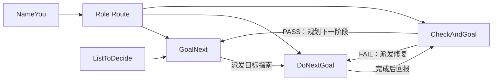

# GoalNext Skill Workflows

一组用于多会话规划、执行、验收与路由的 Codex Skills。仓库中的版本已移除本机路径、真实 thread id、旧项目名称和凭据类信息，可作为可分发基线继续维护。

## 工作流



| Skill | 职责 |
| --- | --- |
| `NameYou` | 将当前 Codex 会话登记为工作区角色，维护最小化的 Role Route。 |
| `ListToDecide` | 将真正需要用户拍板的事项与 Agent 可自行处理的事项分开。 |
| `GoalNext` | 由规划者创建下一阶段 Goal Guide，并派发给执行者。 |
| `DoNextGoal` | 由执行者按轮次实施、验证、提交、推送并回报规划者。 |
| `CheckAndGoal` | 由规划者验收结果；PASS 后进入下一目标，失败时路由修复。 |

完整清单与关系边见 [`skill-set.json`](./skill-set.json)。

## 安装

安装到默认 Codex Skills 目录：

```powershell
powershell -ExecutionPolicy Bypass -File scripts/Install-Skills.ps1
```

指定目录：

```powershell
powershell -ExecutionPolicy Bypass -File scripts/Install-Skills.ps1 -DestinationRoot C:\path\to\codex\skills
```

目标中存在同名 Skill 时，脚本默认停止。确认需要更新后显式添加 `-Force`；它会覆盖同名文件，但不会删除目标目录中的额外文件。

安装或更新后重启 Codex，并同时验证：

- 显式调用，例如 `$nameyou`、`$goalnext`。
- UI 技能选择器中的 `@NameYou`、`@GoalNext` 等条目。

## 验证

```powershell
powershell -ExecutionPolicy Bypass -File scripts/Validate-Skills.ps1
git diff --check
```

验证会检查技能闭包、目录/名称一致性、YAML 元数据、跨 Skill 引用、UTF-8 无 BOM，以及常见凭据、邮箱、本机用户路径和真实 UUID 泄漏。

## 分发约束

- 示例只能使用 `<placeholder>`，不得提交真实 workspace 路径、thread id、邮箱或账号信息。
- `SKILL.md` 与 `agents/openai.yaml` 必须为 UTF-8 无 BOM。
- Role Route 只保存跨会话路由所需的最小字段，不保存对话、项目策略、日志或凭据。
- 新增或删除 Skill 时同步更新 `skill-set.json`、README 和验证规则。

CreateRole 的引导式多 Agent 路由设计已排入 [`ROADMAP.md`](./ROADMAP.md)，本次初始化不实现该 Skill。
