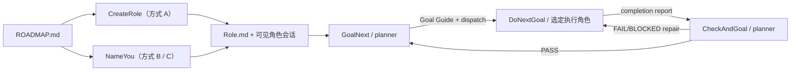

[English](./README.md) | 简体中文

# GoalNext Skill Workflows

GoalNext 是一套面向 Codex 可见会话的工作流 Skill。

简单来说，它让项目中的每个会话承担特定职责，并通过自动对话机制串起工作流。

它把规划、执行、验收和跨会话交接写进项目文档与 Git，使每个会话职责更窄、上下游更清楚，也让用户随时可以检查和干预。

它不依赖隐式 subagent。规划者、执行者和其他专业角色都是你在 Codex 中看得见的会话。

你可能会需要它，是因为你也觉得 Codex 自带的 subagent 不好用：它们不易追溯、不易干预，还经常被主线程跟丢，造成大量空转和资源浪费。但你也完全可以有不同看法，这取决于各自的使用经验。

## 准备工作：一份 Roadmap

1. GoalNext 负责工作流的搭建与推进，前提是项目中已有一份 Roadmap。Roadmap 决定项目方向、阶段顺序和退出条件。

2. 我始终推荐你自己完成 Roadmap 的设计。如果需要 AI 辅助，我推荐使用 [`$grill-me`](https://github.com/mattpocock/skills/tree/main)。

3. 我们也提供 `CreateRoadmap`（调用时写 `$createroadmap`），可以根据文档或自由描述生成 proposed 草案。但这只是兜底方案，不是本项目推荐的默认入口。

上面的外部工具只是在 README 中提供的建议。所有捆绑 Skill 都不会调用或依赖它；CreateRoadmap 的兜底流程只使用本仓库自带能力。

一份可供工作流使用的 Roadmap 至少应包含：

- 项目目标与非范围；
- 可验证的阶段成果；
- 阶段依赖与退出条件；
- 下一项 ready phase；
- 保存为项目根目录的 `ROADMAP.md`。

文件名本身就是确认凭证：`ROADMAP.proposed.md` 表示尚未确认的草案，只有你明确确认后才改名为 `ROADMAP.md`。无需在文档中添加额外的隐藏标记。

除 CreateRoadmap 外，你会使用到的其他 Skill 都会先检查这份证据。若 `ROADMAP.md` 不存在，正常反应是停止原任务，建议你自行设计 Roadmap 或借助 AI 完成设计；只有你同意时，才会调用 CreateRoadmap 兜底。

## 三种使用方式

| 方式 | 适合谁 | 需要掌握的主要 Skill | 后续自动化 |
| --- | --- | --- | --- |
| A. 官方推荐 | 新项目，或愿意建立清晰 planner/executor 分工 | `CreateRole`、`GoalNext` | 最高 |
| B. 改造现有会话 | 已经有若干工作会话，希望接入自动闭环 | `NameYou`、`ListToDecide`、`GoalNext`、`ChooseModel` | 初始化后较高 |
| C. 全手动控制 | 调试、恢复、特殊拓扑，或希望逐步批准每次转移 | `ChooseModel`、`NameYou`、`ListToDecide`、`GoalNext`、`DoNextGoal`、`CheckAndGoal` | 最低 |

### A. 官方推荐：创建角色后自动闭环

这是自动化程度最高、也最容易长期维护的方式。只需要掌握 `CreateRole` 和 `GoalNext`。

开始时：

1. 自己设计并确认根目录 `ROADMAP.md`。
2. 选择一个中央会话，在其中调用 CreateRole：

```text
$createrole 根据 ROADMAP.md 设计角色结构，并在我确认职责、模型、强度、预算和上下游关系后创建可见会话。
```

3. 审阅 `Role.proposed.md` 中的 Role Graph 与 Thread Profile。若中央任务本身位于 linked worktree，CreateRole 会先询问角色应放在保存的项目 checkout 还是明确的新 worktree。随后它会针对完整方案提一次明确的批准问题；确认后，才逐个创建可见会话并激活 `Role.md`。若中途停止，再次调用会从同一 revision 恢复，不会重复创建已完成角色。
4. 在中央会话中启动第一阶段：

```text
$goalnext 根据已确认 Roadmap，为下一个 ready phase 创建 Goal Guide 并派发给已批准的执行角色。
```

之后的预期闭环是：

1. CreateRole 根据你确认的方案创建可见会话，并记录角色、模型配置、预算、交接合同和上下游关系。
2. GoalNext 写入 Goal Guide，并向选定执行角色发送一条带 `$donextgoal` 的路由消息。若多执行角色拓扑没有安全的默认角色，需要指定 `target_role`。
3. 该执行角色自动进入 DoNextGoal，按指南实施、验证、提交、推送并回报中央会话。
4. 中央会话收到回报后自动进入 CheckAndGoal。
5. `PASS` 时 CheckAndGoal 自动进入下一次 GoalNext；`FAIL/BLOCKED` 时把最小修复要求发回产出该结果的执行角色。

正常情况下，你不需要手动掌握 NameYou、ChooseModel、DoNextGoal、CheckAndGoal、RoadmapGate 或 AskMe。它们由 CreateRole 或自动工作流按需使用；你主要负责 Roadmap、关键决策，以及在必要时干预路由。

### B. 改造现有会话：手动初始化，随后自动运行

适合已经在同一项目中拥有中央会话、编码会话或专业会话的团队。目标是保留这些会话，只补齐 Roadmap、角色和路由。

初始化步骤：

1. 自己完成并确认 `ROADMAP.md`；需要 AI 质询时先用 `$grill-me`。
2. 从现有会话中选出一个 planner/checker 和至少一个 executor。
3. 在每个选定会话中调用 `$nameyou`，把真实 thread id 和职责登记进根目录 `Role.md`。
4. 如果哪些事项需要用户拍板、哪些角色应该承担工作仍不清楚，可以在任意相关会话调用：

```text
$listtodecide 列出完成工作流初始化前需要我决定的事项，并给出推荐。
```

5. 如果需要新增会话，或只是想判断某项任务适合什么模型和强度，可以在任意会话使用 `$choosemodel` 获取 Thread Profile。它只给出建议，不会创建会话；默认配置足够时会建议省略 model/effort，只有显式覆盖才要求你确认。
6. 在中央会话中调用 `$goalnext`，把下一阶段整理为正式 Goal Guide 并派发。
7. 如果 executor 正在执行一个旧任务、尚未收到标准路由消息，可以在该 executor 中手动调用一次 `$donextgoal` 并提供当前 Goal Guide。完成回报进入 planner 后，后续恢复为自动闭环。

预期反应：NameYou 只最小修改 `Role.md`；路由冲突或候选会话不唯一时会停下来让你选择；GoalNext 成功后应明确报告 `dispatch result: SENT`。如果是 `BLOCKED`，指南可能已经生成，但不能假装 executor 已收到任务。

### C. 全手动控制：逐步调用全部工作流

这种方式适合调试 Skill、修复损坏路由、演练特殊多角色拓扑，或者你明确希望审查每次阶段转移。它不是日常推荐路径。

一次完整手动循环是：

1. 新建会话前调用 `$choosemodel`，审阅并确认模型/推理强度覆盖。
2. 手动创建会话，然后调用 `$nameyou` 登记角色。
3. 用 `$listtodecide` 解决范围、架构、预算或路由决策。
4. 在 planner 中调用 `$goalnext` 生成并检查 Goal Guide。
5. 手动确认或转发派发消息，在 executor 中调用 `$donextgoal`。
6. executor 完成后，回到 planner 手动调用 `$checkandgoal`。
7. PASS 后再次手动调用 `$goalnext`；FAIL 时检查修复消息，再在 executor 中调用 `$donextgoal`。

即使选择全手动，也通常不需要直接调用 RoadmapGate 或 AskMe。它们是内部契约；CreateRoadmap 只在你没有可用 Roadmap 且明确选择兜底时使用。

## 自动闭环如何衔接



RoadmapGate 会由这些工作流 Skill 在执行前自动检查，无需用户直接调用。方式 B 和 C 用 NameYou 手动登记现有会话；方式 A 则由 CreateRole 完成角色创建与登记。

这个循环依赖三类持久状态：

- `ROADMAP.md`：由用户确认、已经对工作流生效的长期阶段方向；`ROADMAP.proposed.md` 只是尚未生效的草案；
- `Role.md`：本地会话角色、路由和防重复派发字段；`Role.proposed.md` 只在 Role Graph 等待批准或部分恢复时存在；
- Goal Guide 与验证报告：单个阶段的范围、轮次、PASS 标准和完成证据。

## Skill 速查

| Skill | 正常调用者 | 典型反应 |
| --- | --- | --- |
| `CreateRole` | 用户在中央会话中，通常初始化时调用一次 | 提出最小 Role Graph 与 Thread Profile；明确批准后逐个创建可见会话、激活 `Role.md`，并能从部分失败中恢复而不重复扩张。 |
| `GoalNext` | 中央会话或 planner；主要手动入口 | 创建 Goal Guide；派发结果为 `SENT / DUPLICATE / BLOCKED`。 |
| `NameYou` | 采用 B/C 时由用户调用，通常每个会话一次 | 创建或最小更新 `Role.md`；绝不编造 thread id。 |
| `ListToDecide` | 用户或 planner，按需 | 区分必须拍板与 Agent 可自行处理事项，然后等待选择。 |
| `ChooseModel` | 用户按需调用，或由 CreateRole 内部调用 | 返回 `DEFAULT_READY / OVERRIDE_PROPOSED / CONFIRMED_PROFILE / BLOCKED`；只给建议，不创建会话。 |
| `DoNextGoal` | executor 收到派发后自动进入 | 执行 Goal Guide 并回报；planner notification 为 `SENT / DUPLICATE / BLOCKED`。 |
| `CheckAndGoal` | planner 收到完成回报后自动进入 | 返回 `PASS / FAIL / BLOCKED`；通过则规划下一阶段，失败则路由修复。 |
| `RoadmapGate` | 其他 Skill 显式调用的内部依赖 | 返回 `READY / ROADMAP_REQUIRED / BLOCKED`。 |
| `AskMe` | CreateRole 与 CreateRoadmap 使用的内部依赖 | 一次问一个高影响问题，默认五问，返回 `RESOLVED / NEEDS_MORE / BLOCKED / CANCELLED`。 |
| `CreateRoadmap` | 用户明确选择的兜底 | 生成 `ROADMAP.proposed.md`；只有用户明确确认后才提升为 `ROADMAP.md`。 |

Role 不匹配时，Skill 应停止而不是跨职责工作：GoalNext 只属于 planner，DoNextGoal 只属于 executor，CheckAndGoal 只属于 planner/checker。

## 安装

安装到默认 Codex Skills 目录：

```powershell
powershell -ExecutionPolicy Bypass -File scripts/Install-Skills.ps1
```

指定目录：

```powershell
powershell -ExecutionPolicy Bypass -File scripts/Install-Skills.ps1 -DestinationRoot C:\path\to\codex\skills
```

目标目录存在同名 Skill 时，安装默认停止。确认需要更新后显式添加 `-Force`。

安装或更新后重启 Codex，并验证：

- 推荐入口：`$createrole`，随后 `$goalnext`；
- UI 自动补全：`@CreateRole`、`@GoalNext`；
- 改造现有会话：`$nameyou`、`$listtodecide`、`$choosemodel`；
- 仅为恢复或兜底测试：`$createroadmap`、`$askme`。

## 验证

```powershell
powershell -ExecutionPolicy Bypass -File scripts/Validate-Skills.ps1
powershell -ExecutionPolicy Bypass -File scripts/Test-WorkflowContracts.ps1
git diff --check
```

验证覆盖技能闭包、调用分类、Roadmap 文件名门禁、CreateRole 批准与顺序创建契约、多角色路由、README 首次使用路径、ChooseModel 确认契约、跨 Skill 引用、UI 元数据、UTF-8 无 BOM 和常见敏感信息泄漏。

完整技能清单与关系边见 [`skill-set.json`](./skill-set.json)，项目术语见 [`CONTEXT.md`](./CONTEXT.md)，已确认项目阶段见 [`ROADMAP.md`](./ROADMAP.md)。

## 分发约束

- 示例只能使用占位符，不提交真实 workspace 路径、thread id、邮箱、凭据或账号状态。
- `SKILL.md` 与 `agents/openai.yaml` 必须是 UTF-8 无 BOM。
- `Role.md` 与 `Role.proposed.md` 只保存本地跨会话路由状态，不保存对话或项目档案；包含真实 thread id 时绝不能提交。
- 内部 Skill 必须关闭隐式调用，并由调用方显式、可见地进入。
- 模型/强度覆盖必须由用户明确批准；ChooseModel 不推测套餐或额度。
- Git 作者和提交者元数据必须使用 GitHub noreply 地址，避免发布仓库时暴露个人邮箱。
